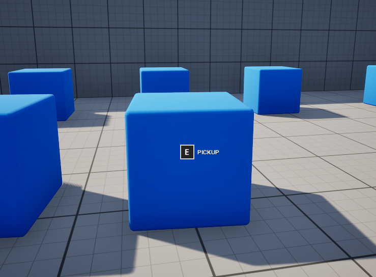

<h1 align="center">🤚Unreal Engine Interaction System</h1>

Third-Person Interaction System for Unreal Engine

## Description ##
Structured object interaction system for third-person characters. It checks distance, collisions, and any obstructions before displaying the interaction prompt. The interactable component automatically creates the widget component if none is found.

## Screenshots ##

## Components ##

- AC_Interaction (Responsible for the object tracking and interaction system. This component is attached to the player)

- AC_Interactable (Responsible for managing interactable objects and requires the InteractableInterface)

## Features
- [x] Component-based architecture [Modular and easy to integrate into any third-person project]
- [x] Interaction prompts [Displays context-sensitive prompts when the player is near interactable objects]
- [x] Dynamic action text [Action descriptions adapt based on the object e.g., "Open," "Pick up," "Read"]
- [x] Dedicated interactable componente [Easily configurable with options like: Interaction distance, Interactable toggle]
- [x] Adaptable to different interaction types [Works with various objects such as doors, items, drawers, switches, etc]
